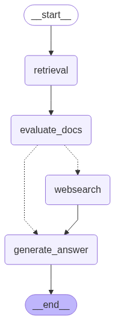

# Agentic RAG

**Goal**

Create an agentic RAG pipeline that with an agent that has 2 tools available:
1. A semantic search retriever to the vector store
2. Web-search tool using Tavily.

## LangGraph Workflow



The agent is designed to do the following:

### Retrieval
Since we assume that most queries from the user will be based on the content of the podcast, the first step of the agentic workflow is always to run the retrieval first. 

### Router
Second, once documents based on the query are retrieved, we use LLM as a judge to determine whether the retrieved documents are relevant to the user query. As we see above, there are two possible paths the agent can take after `evaluate_docs` step. If the documents are indeed relevant, then we simply generate the answer using the retrieved documents and a prompt template to provide to the user.

### Tavily Tool

If the documents were NOT deemed relevant and useful to answer the query, then we call web-search using Tavily and Tavily will search the web for us to get the right answer to the query.

## Output

### When relevant documents are found

We can check that the LangGraph agent intelligently knows how to get to the right answer depending on the user query. For example, if we ask a very specific question like who was the host of this episode of *The Daily*, the agent answers correctly by fetching from the documents in Elasticsearch:

```
Enter your query: Who is the host of this episode of The Daily?
ElasticSearch Client:
 {'name': 'cc05349b72d5', 'cluster_name': 'docker-cluster', 'cluster_uuid': 'dFOa0MkYRPO4ByPmXCcfrg', 'version': {'number': '8.4.3', 'build_flavor': 'default', 'build_type': 'docker', 'build_hash': '42f05b9372a9a4a470db3b52817899b99a76ee73', 'build_date': '2022-10-04T07:17:24.662462378Z', 'build_snapshot': False, 'lucene_version': '9.3.0', 'minimum_wire_compatibility_version': '7.17.0', 'minimum_index_compatibility_version': '7.0.0'}, 'tagline': 'You Know, for Search'} 

Download all-mpnet-base-v2 model from HuggingFace

Get vector embeddings
Next: generate_answer
================================ Human Message =================================

Who is the host of this episode of The Daily?
================================== Ai Message ==================================

Today’s episode was produced by Shannon Lin, Nina Feldman, Michael Simon Johnson, and Anna Foley, with help from Alex Stern and Stella Tan. It was edited by Chris Haxel, Devon Taylor, and MJ Davis Lin, contains original music by Dan Powell and Sophia Lanman, and was engineered by Alyssa Moxley. Our theme music is by Jim Brunberg and Ben Landsverk of Wonderly. That’s it for “The Daily.” I’m Kim Severson. See you tomorrow.

This is “Daily” producer Michael Simon Johnson. I am in downtown Toronto because things are getting real here in Canada.

OK, Anna Foley here, producer on “The Daily.” I have just touched down in Winnipeg in Manitoba, Canada.

From “The New York Times,” I’m Kim Severson, and this is “The Daily.” A gloves-off trade war with America is uniting Canadians from all corners of the country against its southern neighbor. Today, my colleague Matina Stevis-Gridneff on what that trade war means for the future of the relationship and how this fight is shifting the country’s politics, its culture, and its place on the global stage. It’s Thursday, March 13. Matina, you’ve been traveling across Canada reporting on what’s turned out to be a very big news week. Thank you for taking the time to come on the show.

And tonight we’re getting some new details about that Trump-Trudeau dinner from two people who were at the table.
================================== Ai Message ==================================

The host of this episode of The Daily is Kim Severson.
```

We see above that the first AI message is from the document retrieval step. Because the LLM has deemed that there's sufficient information to answer the user question, the workflow continues into the `generate_answer` step that gives the correct answer in the second AI message.


### When relevant documents are NOT found

On the other hand, if we ask a question that does not relate to the content of the documents, it will use the Tavily web-search tool to arrive at the answer. As an example, we ask the LLM about a future NYC election and a recent event that the documents do not contain information on, nor the model was trained on.

```
Enter your query: Who is the current Democratic candidate for the upcoming New York City mayoral race?
ElasticSearch Client:
 {'name': 'cc05349b72d5', 'cluster_name': 'docker-cluster', 'cluster_uuid': 'dFOa0MkYRPO4ByPmXCcfrg', 'version': {'number': '8.4.3', 'build_flavor': 'default', 'build_type': 'docker', 'build_hash': '42f05b9372a9a4a470db3b52817899b99a76ee73', 'build_date': '2022-10-04T07:17:24.662462378Z', 'build_snapshot': False, 'lucene_version': '9.3.0', 'minimum_wire_compatibility_version': '7.17.0', 'minimum_index_compatibility_version': '7.0.0'}, 'tagline': 'You Know, for Search'} 

Download all-mpnet-base-v2 model from HuggingFace

Get vector embeddings
Next: websearch
================================ Human Message =================================

Who is the current Democratic candidate for the upcoming New York City mayoral race?
================================== Ai Message ==================================

Well, the party rallies in a dramatic way around one candidate. His name is Mark Carney. Mark Carney is not a politician. He’s a political novice who hasn’t held elected office, but has been in the public eye for many, many years, really his entire career. He was the governor of the Bank of Canada during the global financial crisis of 2008. And then he went on to become the governor of the Bank of England during Brexit.

Is he trying to put distance between himself and Trump? Has he shifted his campaign?

Are either of these candidates articulating what the future of Canada would look like? Are they talking about what would happen if the United States isn’t at play anymore?

This is “Daily” producer Michael Simon Johnson. I am in downtown Toronto because things are getting real here in Canada.

Who do you blame for all of this?
================================== Ai Message ==================================
Tool Calls:
  tavily_search (call_Fa3HghVu7xqqruOMzjlRQZ4h)
 Call ID: call_Fa3HghVu7xqqruOMzjlRQZ4h
  Args:
    query: 2025 New York City mayoral election Democratic nominee who is the Democratic candidate
    search_depth: advanced
    time_range: year
    topic: news
    include_favicon: True
================================= Tool Message =================================
Name: tavily_search

{"query": "2025 New York City mayoral election Democratic nominee who is the Democratic candidate", "follow_up_questions": null, "answer": null, "images": [], "results": [{"url": "https://en.wikipedia.org/wiki/2025_New_York_City_mayoral_election", "title": "2025 New York City mayoral election - Wikipedia", "content": "An election for the mayor of New York City is scheduled for November 4, 2025. Incumbent Eric Adams, who was elected as a Democrat \"Democratic Party (United States)\"), is seeking re-election to a second term as an independent. He is being challenged by Democratic state assemblyman Zohran Mamdani, Republican \"Republican Party (United States)\") activist Curtis Sliwa, and independent former governor Andrew Cuomo. [...] 2025 New York City Mayoral election( Party | Candidate | Votes | % | ±% |\n| --- | --- | --- | --- | --- |\n|  | Independent | _Eric Adams_ |  |  |  |\n|  | Safe&Affordable | _Eric Adams_ |  |  |  |\n|  | EndAntiSemitism | _Eric Adams_ |  |  |  |\n|  | Total | Eric Adams (Incumbent) |  |  |  |\n|  | Democratic \"Democratic Party (US)\") | _Zohran Mamdani_ |  |  |  |\n|  | Working Families | _Zohran Mamdani_ |  |  |  |\n|  | Total | Zohran Mamdani |  |  |  | [...] | Poll source | Date(s) administered | Sample size( | Margin of error | Andrew Cuomo (D) | Brad Lander (WFP) | Undecided |\n| --- | --- | --- | --- | --- | --- | --- |\n| Upswing Research & Strategy (D)( | – | 200 (LV)( | – | 41% | 38% | 21% |\n\nAndrew Cuomo vs. Zohran Mamdani as WFP nominee", "score": 0.93425745, "raw_content": null, "favicon": "https://en.wikipedia.org/static/favicon/wikipedia.ico"}, {"url": "https://www.cityandstateny.com/politics/2025/08/heres-whos-running-new-york-city-mayor-2025/401994/", "title": "Here's who's running for New York City mayor in 2025", "content": "Skip to Content\n\n---\n\n---\n\n---\n\n---\n\n---\n\n---\n\n2025 New York City Mayoral Election\n\n# Here’s who’s running for New York City mayor in 2025\n\n## Get to know the candidates in a wide, weird field.\n\nNew York City Democratic mayoral candidate Zohran Mamdani\nKyle Mazza/Anadolu via Getty Images\n\n---\n\nBy \nSahalie Donaldson, Annie McDonough and Holly Pretsky\n\n |\n\nBy \nSahalie Donaldson, Annie McDonough and Holly Pretsky [...] innate charisma, absolutely dominated. Now, the 33-year-old democratic socialist Assembly member is the Democratic nominee in the general election, where he faces the incumbent Mayor Eric Adams, Republican candidate Curtis Sliwa, independent candidate Jim Walden and, once again, Cuomo. [...] Here are all the prominent mayoral contenders. This post was last updated August 12. Democratic primary candidates who lost are archived here.\n\nSkip to: Independent incumbent Eric Adams, Democratic nominee Zohran Mamdani, independent Andrew Cuomo, Republican nominee Curtis Sliwa, independent Jim Walden\n\n## Eric Adams\n\nNew York City mayor", "score": 0.9323611, "raw_content": null, "favicon": "https://cityandstateny.com/favicon-32x32.png"}, {"url": "https://www.cityandstateny.com/politics/2025/06/heres-whos-running-new-york-city-mayor-2025/401994/", "title": "Here's who's running for New York City mayor in 2025", "content": "Here are all the prominent mayoral contenders. This post was last updated July 17. Democratic primary candidates who lost are archived here.\n\nSkip to: Independent incumbent Eric Adams, Democratic nominee Zohran Mamdani,independent Andrew Cuomo, Republican nominee Curtis Sliwa, independent Jim Walden", "score": 0.918663, "raw_content": null, "favicon": "https://cityandstateny.com/favicon-32x32.png"}], "response_time": 1.82, "request_id": "3793c1e6-d29e-4ea2-b98c-c2347680baec"}
================================== Ai Message ==================================

Zohran Mamdani is the current Democratic candidate for the upcoming New York City mayoral race.
```

Our agent is smart enough to know to call the Tavily web-search tool upon seeing a question it cannot find answers to in the retrieved documents. Above, we see the tool call followed by a Tool Message.